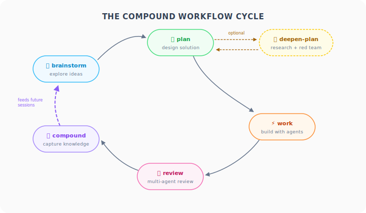

# compound-workflows

Fork of [Every's compound-engineering](https://github.com/EveryInc/compound-engineering-plugin) for [Claude Code](https://docs.anthropic.com/en/docs/claude-code). Adds agents that don't exhaust context, session recovery after exhaustion, compaction-safe task tracking, multi-model red team ([PAL](https://github.com/BeehiveInnovations/pal-mcp-server) + Claude), fewer plan iterations via readiness checks, and tiered memory management.

## What is Compound Engineering?

[Compound engineering](https://every.to/guides/compound-engineering) is a methodology where each unit of engineering work makes subsequent units easier. You document solutions, capture decisions with their rationale, and build institutional knowledge that compounds over time.

**Compound workflows** generalize this idea beyond software engineering to all knowledge work — an opinionated way to use Claude Code for research, planning, decision-making, and implementation. The cycle remains the same: brainstorm → plan → work → review → compound.

<p align="center">
  
</p>

## Why Fork?

Ambitious tasks in Claude Code hit walls:

- **Context exhaustion** — Agent outputs fill up context and trigger compaction.
  → Agents write to disk and return summaries, so sessions last longer.
- **State loss** — Work progress disappears on compaction.
  → `/compact-prep` and `/recover` handle planned and unplanned session boundaries; [beads](https://github.com/steveyegge/beads) tracking survives across compactions.
- **Plan iteration overhead** — Plans require many rounds to reach quality.
  → Readiness checks and consolidation catch issues earlier, preventing the fix-introduces-new-bug cycle.
- **Single-model blind spots** — One model can't catch its own assumptions.
  → Red team challenges from multiple providers (Gemini, OpenAI, Claude) surface what a single model misses.
- **Knowledge loss** — Context learned in one session is gone in the next.
  → Tiered memory management promotes frequently-used knowledge to where it's auto-loaded.

## What's Different

| | compound-engineering | compound-workflows |
|---|---|---|
| Agents | 22 bundled | 24 bundled (forked, self-contained) |
| Red team | Single model | 3 providers in parallel with configurable model selection |
| Agent outputs | In-context (fills up) | Disk-persisted to `.workflows/` |
| Task tracking | TodoWrite only | Beads preferred, TodoWrite fallback |
| Config | Single file | Split: committed project + gitignored machine-specific |
| Session recovery | Manual | `/compact-prep` (proactive) + `/recover` (reactive, JSONL log parsing) |
| Memory management | None | Adapted fork of Anthropic's memory skill with tiered storage (in progress) |
| Plan quality | Unbounded iteration | Readiness checks, auto-consolidation, and signals for when to stop iterating |

## Install

```
/plugin marketplace add adamfeldman/compound-workflows
/plugin install compound-workflows
```

> **Warning:** Do not install alongside compound-engineering. This plugin bundles all agents and skills. Installing both will cause agent name conflicts. Run `/compound:setup` to detect and resolve conflicts.

Then run setup to detect your environment:

```
/compound:setup
```

## Update

From your terminal:

```
claude plugin update compound-workflows@compound-workflows-marketplace
```

Or use the interactive `/plugin` menu inside Claude Code.

## Commands

| Command | Purpose |
|---------|---------|
| `/compound:setup` | Detect environment, configure directories, recommend enhancements |
| `/compound:brainstorm` | Explore requirements through collaborative dialogue |
| `/compound:plan` | Transform ideas into implementation plans with research agents |
| `/compound:deepen-plan` | Enhance plans with parallel research + red-team challenges |
| `/compound:work` | Execute plans via subagent dispatch with task tracking |
| `/compound:review` | Multi-agent code review with disk-persisted findings |
| `/compound:compound` | Document solved problems to build institutional knowledge |
| `/compound:compact-prep` | Pre-compaction checklist — save context before `/compact` |
| `/compound:recover` | Recover context from dead/exhausted sessions via JSONL log parsing |

### Workflow Cycle

```
brainstorm -> plan -> [deepen-plan] -> work -> review -> compound
```

Each step produces documents that feed the next. Solutions feed future brainstorms.

### Session Recovery

Context exhaustion is inevitable in long sessions. Two paths:

- **Proactive:** `/compound:compact-prep` before `/compact` — saves memory, checks for uncommitted work, queues a resume task. Say "resume" after compaction.
- **Reactive:** `/compound:recover` when a session dies without compaction — parses the JSONL session log, cross-references git/beads/.workflows/plan state to reconstruct progress and extract what would otherwise be lost.

## Dependencies

| Tool | Required? | What it enables |
|------|-----------|-----------------|
| [beads](https://github.com/steveyegge/beads) (`bd`) | Recommended | Compaction-safe task tracking |
| [PAL MCP](https://github.com/BeehiveInnovations/pal-mcp-server) | Optional | Multi-model red team — dispatches to Gemini, OpenAI, and other providers. Also supports file-aware review via Gemini CLI and Codex CLI. |
| GitHub CLI (`gh`) | Optional | PR creation in work/review |

Without beads: TodoWrite fallback (loses state on compaction). Without PAL: Claude-only subagent fallback (single model).

## Key Concept: Disk-Persisted Agents

Instead of agents returning full results into conversation context (which fills up and compacts), every agent writes findings to `.workflows/` and returns only a 2-3 sentence summary.

- **Context stays lean** — run 15+ agents without exhaustion
- **Research survives** — files persist across sessions and compactions
- **Traceability** — see exactly what informed each decision
- **Recovery** — disk files + beads = full recovery after compaction

## Attribution

Includes agents and skills forked from [Every's compound engineering plugin](https://github.com/EveryInc/compound-engineering-plugin) (MIT). The brainstorm-plan-work-review-compound cycle, agent-based review architecture, and knowledge compounding philosophy originate from that project. See `NOTICE` and `FORK-MANIFEST.yaml` for provenance.

## License

[MIT](LICENSE)
